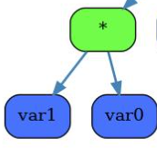
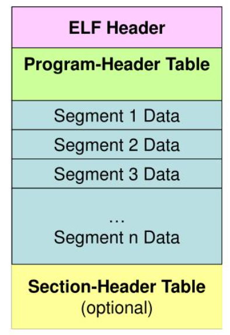

# Компиляция в asm и elf

Этот проект - продолжение проекта моего [языка](https://github.com/ogkisque/My-language). Его back-end генерировал файл ассемблера для моего [процессора](https://github.com/ogkisque/Processor). Задача этого проекта - переписать его, чтобы генерировался elf - файл, который может исполняться в linux. Так же для дебага будем генерировать asm файл.

## Общая схема компиляции

Front-end парсит язык в дерево команд. Middle-end упрощает это дерево. Back-end делится на несколько частей. Сначала из дерева генерируется IR (intermediate representation) - массив структур, каждая из которых отвечает за одну ассемблерную команду. Потом из IR нужно сгенерировать asm и elf файлы.

## Генерация IR

Договоримся, что переменные будут храниться в памяти и обращаться к ним я буду так: [r15 + n * 8], где n - номер текущей локальной переменной. Таким образом, r15 - адрес начала стекового фрейма текущей функции (только в памяти, а не в стеке, для упрощения передачи аргументов в функции).

Операции будут выполняться через обычный стек.

Деревья функций будут переводиться в массив функций, в каждой из которой будет массив блоков IR. В блоке хранится тип операции, типы операндов, их значения, бинарный код, его размер, смещение блока относительно начала функции.

### Добавление блоков

Проходом по дереву будем добавлять блоки в IR.

Например, такой кусок дерева:

      

Перейдёт в:

Тип операции | Тип операнда 1 | Значение операнда 1 | Тип операнда 2 | Значение операнда 2 
---          | ---            | ---                 | ---            |---                  
IR_PUSH      | IR_VAR         | 1                   | IR_NONE        | -                   
IR_PUSH      | IR_VAR         | 0                   | IR_NONE        | -                   
IR_POP       | IR_REG         | r11                 | IR_NONE        | -                   
IR_POP       | IR_REG         | r10                 | IR_NONE        | -                   
IR_MUL       | IR_REG         | r10                 | IR_REG         | r11
IR_PUSH      | IR_REG         | r10                 | IR_NONE        | -                           

### Добавление бинарных кодов

Сделаем таблицу с бинарными кодами всех операций, и будем сразу заполнять ими блоки IR. Тот же самый пример:

Тип операции | Тип операнда 1 | Значение операнда 1 | Тип операнда 2 | Значение операнда 2 | Бинарный код
---          | ---            | ---                 | ---            | ---                 | ---
IR_PUSH      | IR_VAR         | 1                   | IR_NONE        | -                   | 0х41 0хff 0х77 0х08       
IR_PUSH      | IR_VAR         | 0                   | IR_NONE        | -                   | 0х41 0хff 0х77 0х00
IR_POP       | IR_REG         | r11                 | IR_NONE        | -                   | 0х41 0х5b
IR_POP       | IR_REG         | r10                 | IR_NONE        | -                   | 0х41 0х5a
IR_MUL       | IR_REG         | r10                 | IR_REG         | r11                 | 0х4d 0х0f 0хaf 0хd3
IR_PUSH      | IR_REG         | r10                 | IR_NONE        | -                   | 0х41 0х52

Остаётся добавить адреса прыжков и вызовов функций.

Для расчёта прыжков для каждой функции добавим таблицу меток, в которой будем хранить их смещения. Тогда расчёт прыжка становится очень простым: найти в этой таблице соответствующую метку и вычесть из текущего смещения ее смещение.

Для каждой функции будем считать ее смещение относительно сегмента .text. Тогда расчёт адресов вызовов функций практически не отличается от расчёта прыжков. Единственный нюанс - стандартная библиотека, для вызова её функций нужно знать её размер. Пока что я просто храню его в константе, но в дальнейшем это следует изменить, чтобы можно было менять библиотеку, не изменяя кода компилятора.

## Генерация asm

Из IR достаточно просто сгенерировать ассемблерный код программы. Рассмотрим тот же пример:

Тип операции | Тип операнда 1 | Значение операнда 1 | Тип операнда 2 | Значение операнда 2 | asm
---          | ---            | ---                 | ---            | ---                 | ---
IR_PUSH      | IR_VAR         | 1                   | IR_NONE        | -                   | push [r15 + 8]
IR_PUSH      | IR_VAR         | 0                   | IR_NONE        | -                   | push [r15 + 0]
IR_POP       | IR_REG         | r11                 | IR_NONE        | -                   | pop r11
IR_POP       | IR_REG         | r10                 | IR_NONE        | -                   | pop r10
IR_MUL       | IR_REG         | r10                 | IR_REG         | r11                 | imul r10, r11
IR_PUSH      | IR_REG         | r10                 | IR_NONE        | -                   | push r10

Стандартную библиотеку импортируем директивой %INCLUDE

## Генерация elf

Такова структура у elf файла:

      

В моём случае будет только 2 сегмента - .text и .data.
Секция .text по сути представлена в IR. Единственная задача этого этапа - заполнение заголовков.

Для этого можно воспользоваться библиотекой <elf.h>. Так выглядит структура заголовка elf:

| Поле заголовка elf    | Что в нём лежит |
| ---                   | ---           |
| e_ident               | Магическое число |
| e_type                | Тип объектного файла    |
| e_machine             | Архитектура   |
| e_version             | Версия объектного файла   |
| e_entry               | Адрес точки входа   |
| e_phoff               | Смещение таблицы заголовков программы в файле   |
| e_shoff               | Смещение таблицы заголовков секций в файле    |
| e_flags               | Флаги, зависящие от процессора   |
| e_ehsize              | Размер заголовка ELF в байтах   |
| e_phentsize           | Размер записи таблицы заголовков программы    |
| e_phnum               | Количество записей в таблице заголовков программы |
| e_shentsize           | Размер записи таблицы заголовков секций        |
| e_shnum               | Количество записей в таблице заголовков секций        |
| e_shstrndx            | Индекс таблицы строк в заголовке секции       |

Всё это, кроме адреса точки входа, у меня будет константами. Адрес точки входа = адрес .text + размер библиотеки + смещение main = стартовый адрес + выравнивание + размер библиотеки + смещение main. Стартовый адрес берём 0х400000, выравнивание - 0х1000.

Так выглядит структура заголовка для сегмента:

| Поле структуры заголовка сегмента | Что в нём лежит |
| ---                               | ---             |
| p_type                            | Тип сегмента |
| p_offset                          | Смещение от начала файла |
| p_vaddr                           | Виртуальный адрес сегмента |
| p_paddr                           | Физический адрес сегмента |
| p_filesz                          | Размер образа файла сегмента |
| p_memsz                           | Размер образа сегмента |
| p_align                           | Выравнивание |
| p_flags                           | Флаги сегмента |

Здесь всё заполняется константами. У сегментов кода и данных будут отличаться размеры, адреса и флаги (у данных будет разрешение на запись).

## Сравнение скорости выполнения программы

Напишем программу, в которой будем 10000 раз считать факториал 8 (рекурсивно), и сравним скорость ее выполнения. Будем сравнивать скорость генерируемого мной elf-файла, генерируемого gcc elf-файла (из генерируемого мной ассемблера), генерируемого llvm elf-файла (из генерируемого мной llvm формата, этот проект описан [тут](https://github.com/ogkisque/Binary-Translator-LLVM-IR)) и программы, запущенной на моём процессоре.

Время будем измерять через rdtsc.

Исполнение              | Кол-во тиков    | Абсолютное ускорение                    | Относительное ускорение 
---                     | ---             | ---                                     | ---
мой процессор           | 79722571967     | 1                                       | 1.00
elf из llvm             | 7429222         | 10731                                   | 10730.94
elf из asm              | 7354701         | 10840                                   | 1.01
мой elf                 | 6815915         | 11697                                   | 1.08

## Заключение

В результате из дерева генерируется IR формат, из которого потом создается ассемблерный файл и исполняемый elf.

В дальнейшем нужно добавить оптимизации. Например, упрощение подряд идущих push и pop. Так же можно хранить несколько элементов с верхушки стека в регистрах (для ускорения обращения к ним).

Кроме этого, нужно сделать IR формат более общим, поскольку сейчас он тесно связан с архитектурой x86-64. На самом деле он должен быть универсальным, чтобы из него можно было сгенерировать код для любыъ архитектур.
