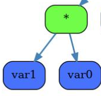
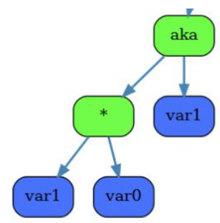
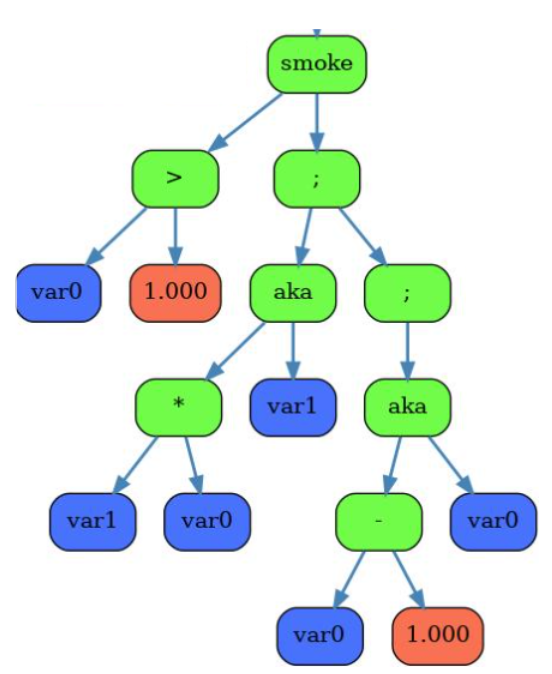
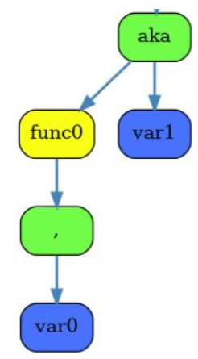

# Компилятор в LLVM IR

Этот проект - продолжение проекта моего [языка](https://github.com/ogkisque/My-language). Его back-end генерировал файл ассемблера для моего [процессора](https://github.com/ogkisque/Processor). Задача этого проекта - переписать его, чтобы генерировался файл в формате LLVM IR. Его можно скомпилировать в исполняемый файл:
```
llc llvm.ll     // результат - llvm.s
g++ llvm.s      // результат - a.out
```

## Немного об LLVM IR

Для понимания приведу пример программы:

```
int func (int a, int b) {
    return a + 2 * b;
}

int main() {
    return func (11, 99);
}
```

Через clang можно скомпилировать в LLVM IR следующим образом:

```
clang -S -emit-llvm -o foo.ll foo.c.
```

Получится:

```
define i32 @func(i32 %a, i32 %b) {
    %1 = mul i32 2, %b
    %2 = add i32 %a, %1
    ret i32 %2
}

define i32 @main() {
    %1 = call i32 @f(i32 11, i32 99)
    ret i32 %1
}
```

Видно, что это похоже на формат ассемблера, но немного ближе к чему-то высокоуровневому. Важное свойство этого формата заключается в том, что он представлен в SSA форме (Static Single Assignment). Здесь "бесконечно" регистров, но каждому из них присваивание можно выполнять только 1 раз.

Так же и с переменными. Поэтому я буду аллоцировать переменные в памяти (alloca): при обращении к ним я буду выгружать их оттуда (load), а при присваивании им значений наоборот загружать в память (store). То есть все переменные у меня будут не double, а double*.

## Генерация LLVM IR из дерева

Команды моего языка парсятся в дерево на этапе back-end, потом оно упрощается на этапе middle-end и приходит в back-end. Тогда наша задача сгенерировать из дерева команд формат LLVM IR.

#### 1. Выражения

Будем возвращать значения выражений через память. А именно в аргументе этой функции через указатель будем передавать номер регистра, по адресу которого лежит значение выражения. Например, кусок дерева:

<p align = "left">
      
</p>

Перейдёт в:

```
%0 = alloca double, align 8
%1 = load double, double* %var1p, align 8
store double %1, double* %0, align 8            // загрузка переменной var1 в адрес, равный 0-ому регистру

%2 = alloca double, align 8
%3 = load double, double* %var0p, align 8
store double %3, double* %2, align 8            // загрузка переменной var0 в адрес, равный 2-ому регистру

%4 = load double, double* %0, align 8           // выгрузка переменной var1
%5 = load double, double* %2, align 8           // выгрузка переменной var0
%6 = fmul double %4, %5                         // вычисление произведения                 
%7 = alloca double, align 8
store double %6, double* %7, align 8            // загрузка результата в адрес, равный 7-ому регистру
```

#### 2. Присваивания

Здесь всё просто, нужно загрузить полученный результат в память. Продолжим предыдущий пример:

<p align = "left">
      
</p>

(aka - это приравнивание в моём языке)

Перейдёт в:

```
...                                             // вычисление произведения в адрес, равный 7-ому регистру

%8 = load double, double* %7, align 8
store double %8, double* %var1p, align 8        // загрузка результата в переменную
```

#### 3. Условные выражения и циклы

Рассмотрим пример цикла (в случае ветвления будет то же самое, только проще):

<p align = "left">
      
</p>

(smoke - это while в моём языке)

```
br label %while0
while0:                                         // метка начала цикла
...                                             // вычисление операндов сравнения в регистры %7 и %8
%9 = fcmp ogt double %7, %8                     // %9 - результат сравнения
br i1 %9, label %body_while0, label %end_while0 // переход на метку body_while0, если true, на метку end_while0, если false
body_while0:                                    // метка тела цикла
...                                             // тело цикла
br label %while0                                // переход в начало цикла
end_while0:                                     // метка конца цикла
```

#### 4. Функции

Это в LLVM IR сделано очень удобно. Так выглядит объявленеие функции:

```
define dso_local double @func0(double %var0)
{
...                                             // тело функции
ret double %26                                  // возвращение результата
}
```

В моём случае все возвращаемые значения - double (и в целом все числа). Параметры перечисляются в скобках через запятую.

Вызов функции тоже прост:

<p align = "left">
      
</p>

Перейдет в:

```
%0 = load double, double* %var0p, align 8           // загрузка переменной из памяти
%1 = call double @func0(double noundef %0)          // вызов функции, результат в %1
%2 = alloca double, align 8
store double %1, double* %2, align 8                // загрузка результата в адрес, равный 2-ому регистру
```

Так же у функций можно указывать атрибуты, которые могут, например, ускорить их работу. Я не буду добавлять их тут. (Например, атрибут noinline говорит о том, что эту функцию нельзя инлайнить ни при каком условии. norecurse сообщает, что в функции нет рекурсии.)

Для вызова библиотечных printf, scanf их нужно добавить следующим образом:

```
declare i32 @__isoc99_scanf(i8* noundef, ...)
declare i32 @printf(i8* noundef, ...)

@.str = private unnamed_addr constant [4 x i8] c"%lf\00", align 1       // строка формата для scanf
@.str.1 = private unnamed_addr constant [5 x i8] c"%lf\0A\00", align 1  // строка формата для printf
```

Так осуществляется вызов:

```
%0 = call i32 (i8*, ...) @__isoc99_scanf(i8* noundef getelementptr inbounds ([4 x i8], [4 x i8]* @.str, i64 0, i64 0), double* noundef %var0p)      // в 0-ую переменную положится считанное число

%2 = call i32 (i8*, ...) @printf(i8* noundef getelementptr inbounds ([5 x i8], [5 x i8]* @.str.1, i64 0, i64 0), double noundef %1)                 // выведется число из 1-ого регистра
```

## Заключение

В результате генерируется LLVM IR формат. В дальнейшем нужно добавить промежуточное представление, чтобы создавать LLVM IR не из дерева.

Так же нужно будет добавить оптимизации (они достаточно хорошо ложатся на этот формат).